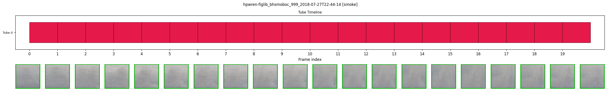
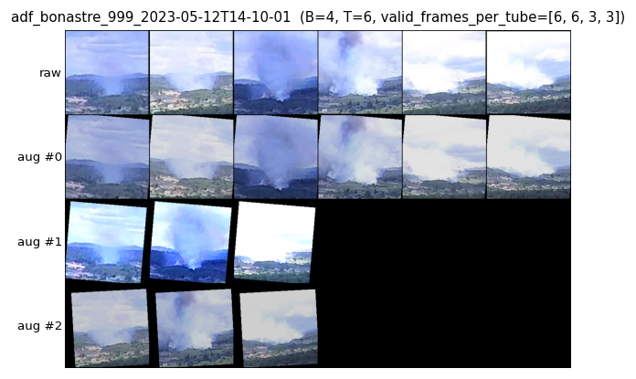
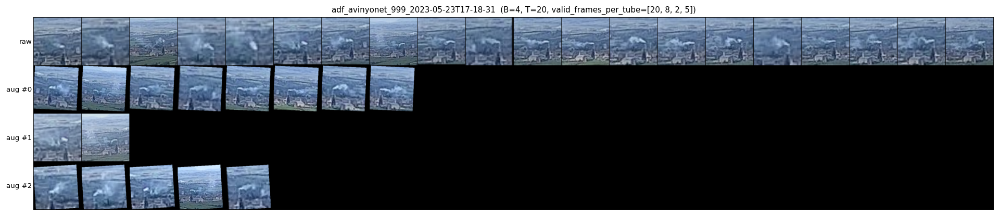
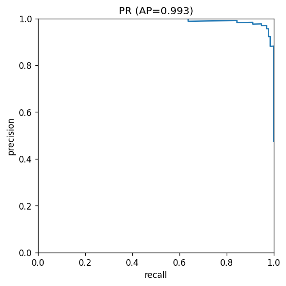
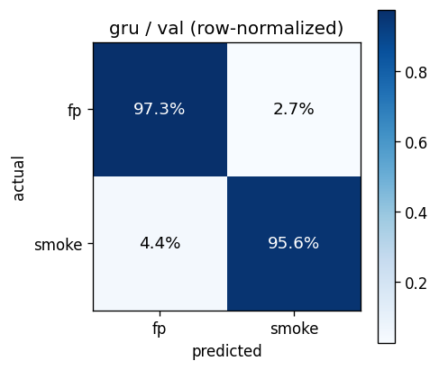
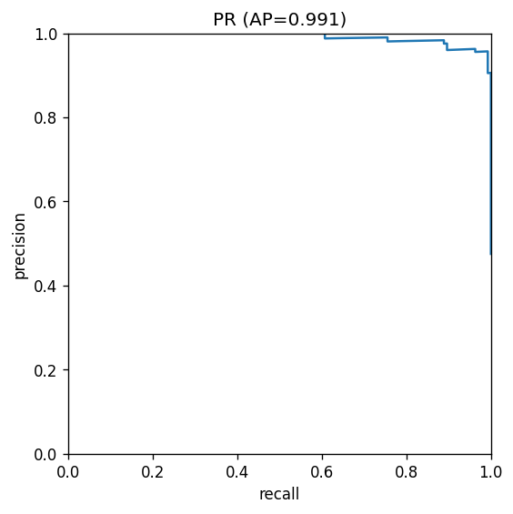
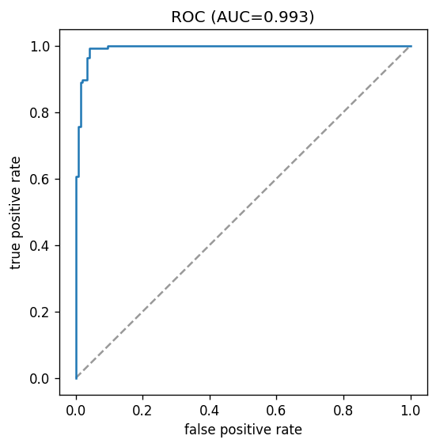
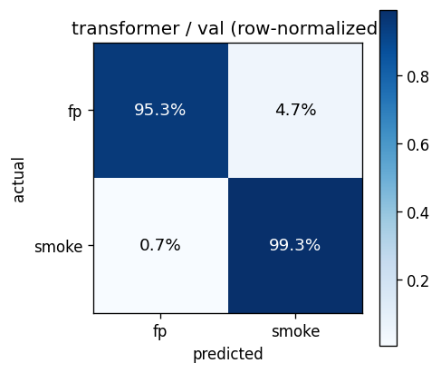

# bbox-tube-temporal

Bbox-tube temporal smoke classifier for Pyronear camera sequences. Plugs into the `pyrocore.TemporalModel` protocol, learning a binary sequence-level label (smoke / no smoke) over short tubes of YOLO-detected regions.

## Motivation

Pyronear deploys fixed 360° cameras on antenna towers that capture one image every 30 seconds. An on-device YOLOv10 detector runs at high recall, so a non-trivial share of candidate detections are non-smoke (clouds, dust, lens artefacts). This experiment trains a server-side temporal verifier that takes a short sequence of frames plus YOLO bboxes and outputs a single smoke / no-smoke decision per sequence — keeping recall while cutting false positives. Fixed cameras (static background) and sparse cadence (30 s, not dense video) shape the design: we do not need dense optical flow or 3D convolutions; we do need models that behave correctly on short, occasionally-gappy tubes.

## Architecture

```
raw sequence  ->  truncate  ->  build tubes  ->  224x224 patches  ->  timm backbone  ->  temporal head  ->  sequence logit
                  (max 20f)    (greedy IoU      (per tube entry,     (frozen or        (mean-pool,
                                matching)       context-expanded)     last-N fine-     GRU, or
                                                                      tuned)            transformer)
```

Each arrow is one stage of the DVC pipeline and is implemented in a single module:

- `truncate` → `scripts/truncate_sequences.py` (cap at `truncate.max_frames=20`).
- `build_tubes` → `src/bbox_tube_temporal/tubes.py` (greedy IoU linker).
- `build_model_input` → `src/bbox_tube_temporal/model_input.py` (context-expanded square crop + resize).
- `train_<variant>` → `scripts/train.py` + `src/bbox_tube_temporal/{temporal_classifier.py,lit_temporal.py}`.
- `evaluate_<variant>` → `scripts/evaluate.py` + `src/bbox_tube_temporal/eval_plots.py`.
- `package` → `scripts/package_model.py` (zips YOLO + classifier + calibrated threshold + optional `LogisticCalibrator`).

YOLO bboxes are pre-computed and shipped with the dataset; we do not run YOLO during training.

## How tubes are built

A *tube* is a chain of YOLO detections linked across consecutive frames that spatially correspond to the same candidate smoke region. `build_tubes` (`src/bbox_tube_temporal/tubes.py:88-192`) uses greedy IoU matching:

1. For each new frame, match each active tube's most recent detection to the new frame's detections, one-to-one, keeping pairs with IoU ≥ `tubes.iou_threshold=0.2`.
2. Unmatched detections start new tubes. Unmatched tubes accumulate misses; a tube is terminated after `tubes.max_misses=2` consecutive miss frames.
3. Intermediate miss frames are later filled by linear interpolation of the surrounding bboxes (confidence 0; `is_gap=True`), so every tube has one entry per frame between `start_frame` and `end_frame`.
4. Tubes shorter than `build_tubes.min_tube_length=4` are discarded.

Data structures are in `src/bbox_tube_temporal/types.py:34-60` (`TubeEntry`, `Tube`). A rendered example — each row is one frame of a tube, showing the YOLO bbox and context-expanded crop — is below:



More tube renders live under `data/08_reporting/tubes/val/{smoke,fp}/` (DVC-tracked, pull with `uv run dvc pull`).

## Patch extraction

Each tube entry becomes one 224×224 RGB patch (`src/bbox_tube_temporal/model_input.py:18-57`). The bbox is expanded by `model_input.context_factor=1.5` to include surrounding sky/plume context, made square using the larger side (in pixels, clamped to the image), cropped, then resized to `model_input.patch_size=224` and saved as PNG. Patches are normalized to ImageNet mean/std at load time, not at crop time, so the on-disk PNGs remain viewable.

## Classifier

### Backbones

All backbones come from `timm` and are wrapped in `TimmBackbone` (`src/bbox_tube_temporal/temporal_classifier.py:9-100`), which optionally freezes all layers except the last `finetune_last_n_blocks` and exposes those as a separate optimizer param group with a lower `backbone_lr`.

| `backbone` config | `timm` model | Pretrain |
|---|---|---|
| `resnet18` | `resnet18` | ImageNet-1k |
| `convnext_tiny` | `convnext_tiny` | ImageNet-1k |
| `convnext_base` | `convnext_base` | ImageNet-1k |
| `vit_small_patch14_dinov2.lvd142m` | ViT-S/14 | DINOv2 (LVD-142M, self-supervised) |
| `vit_small_patch16_224.augreg_in21k_ft_in1k` | ViT-S/16 | IN21k → IN1k supervised |

### Temporal heads

The backbone is applied per frame, then features `(batch, time, feat_dim)` plus a boolean `(batch, time)` mask are fed to one of three heads (all in `src/bbox_tube_temporal/temporal_classifier.py`):

- **`mean_pool`** (`:103-119`) — masked mean over time, then a 2-layer MLP → 1 logit. Simplest head; no temporal modelling beyond averaging. Hyperparameter: `hidden_dim`.
- **`gru`** (`:122-161`) — single-layer GRU over valid frames via `pack_padded_sequence`, last hidden state → MLP → 1 logit. Hyperparameters: `hidden_dim`, `num_layers`, `bidirectional`.
- **`transformer`** (`:164-215`) — learnable `[CLS]` token prepended, learned positional embeddings, 2-layer pre-norm TransformerEncoder, `[CLS]` output → MLP → 1 logit. Hyperparameters: `transformer_num_layers`, `transformer_num_heads`, `transformer_ffn_dim`, `transformer_dropout`.

### Training loop

`scripts/train.py:28-177` is the entry point. Training is run through PyTorch Lightning (`LitTemporalClassifier` in `src/bbox_tube_temporal/lit_temporal.py:12-166`):

- **Loss**: `BCEWithLogitsLoss` on sequence-level labels.
- **Optimizer**: `AdamW`. When `finetune=true`, two param groups — head at `learning_rate`, unfrozen backbone blocks at the smaller `backbone_lr` (typically `1e-5`). See `lit_temporal.py:120-166`.
- **Schedule**: plain constant LR by default; ViT variants enable `use_cosine_warmup=true` with `warmup_frac=0.05` (linear warmup, then cosine anneal).
- **Duration**: `max_epochs=30` with early stopping on val F1, `early_stop_patience=5`. `ModelCheckpoint` keeps the best-F1 weights.
- **Reproducibility**: `L.seed_everything(cfg["seed"], workers=True)` + `Trainer(deterministic=True)` → bitwise-identical runs on the same hardware (see *Reproducibility* below).

## Data augmentation

Augmentation runs on training data only and is **per-tube-consistent**: one set of parameters is sampled per tube and applied identically to every frame in that tube, so the sequence stays coherent (a flip flips every frame; a brightness bump bumps every frame). Implementation is in `src/bbox_tube_temporal/augment.py`.

**Spatial** (`augment.py:15-62`, applied via `torchvision.transforms.v2.functional.affine`):
- Horizontal flip, `flip_prob=0.5`.
- Rotation, ±`rotation_deg=5.0`°.
- Scale, uniform in `scale_range=[0.9, 1.1]`.
- Translation, up to ±`translate_frac=0.05` of H/W.

**Photometric** (`augment.py:65-105`, clamped to [0, 1] after each step):
- Brightness factor in `brightness_range=[0.8, 1.2]`.
- Contrast factor in `contrast_range=[0.8, 1.2]`.
- Saturation factor in `saturation_range=[0.8, 1.2]`.

**Temporal** (`augment.py:108-177`):
- Subsequence sampling: with `subseq_prob=0.5`, pick a random contiguous window of length ≥ `subseq_min_len=4`.
- Random stride-2: with `stride_prob=0.25`, keep every other frame.
- Per-frame drop: each frame dropped independently with `frame_drop_prob=0.15`, with a floor of `min_valid_after_drop=4` valid frames. Remaining frames are re-compacted to the prefix `[0..k-1]` so `pack_padded_sequence` still sees a clean valid-then-padding layout.

**Validation / test** get `build_tube_augment(cfg, train=False)` (`augment.py:224-256`), which skips all of the above and applies only ImageNet normalization.

Two pre-rendered grids (raw + 8 augmented variants of the same tube):





Live copies under `data/08_reporting/augment_samples/` are regenerated by `scripts/visualize_augment.py`; interactively tweak parameters in `notebooks/03-visualize-augment-transforms.ipynb`.

## Symmetric padding at inference

Training always sees tubes padded to `truncate.max_frames=20` with a valid-frame mask, so pad length is only a masking concern. At inference on a live short sequence (e.g. only 6 available frames) we instead need to *extend* the sequence before running the classifier, because we want the model to see a distribution of frames close to what it saw during training. Two strategies are available (`src/bbox_tube_temporal/inference.py:21-66`):

- `pad_strategy: symmetric` — alternately prepend the first frame and append the last until we reach `pad_to_min_frames=20`. Keeps real frames centred.
- `pad_strategy: uniform` — spread the real frames evenly across the 20 slots by floor-mapped indexing (`i * N // M`). Useful when a transformer head is sensitive to duplicate clustering.

`symmetric` is the default for the currently packaged models. This is an inference-only concern; training still uses zero-pad plus a boolean mask.

## Variants

All 11 variants share the `truncate → build_tubes → build_model_input` inputs; they differ only in backbone, temporal head, seed, and whether the backbone is fine-tuned. The sweep encodes three ablations:

- **Head**: `mean_pool` vs `gru` vs `transformer`.
- **Backbone**: ResNet18 → ConvNeXt-Tiny → ConvNeXt-Base → ViT-S (DINOv2) / ViT-S (IN21k).
- **Fine-tune**: frozen backbone vs last-block fine-tune (`finetune_last_n_blocks=1`, `backbone_lr=1e-5`).

| Variant | Backbone | Head | Seed | Fine-tune |
|---------|----------|------|------|-----------|
| `train_mean_pool` | resnet18 | mean-pool | 42 | no |
| `train_gru` | resnet18 | GRU | 42 | no |
| `train_gru_seed43` | resnet18 | GRU | 43 | no |
| `train_gru_seed44` | resnet18 | GRU | 44 | no |
| `train_gru_convnext` | convnext_tiny | GRU | 42 | no |
| `train_gru_finetune` | resnet18 | GRU | 42 | last 1 block |
| `train_gru_convnext_finetune` | convnext_tiny | GRU | 42 | last 1 block |
| `train_gru_convnext_base_finetune` | convnext_base | GRU | 42 | last 1 block |
| `train_vit_dinov2_frozen` | ViT-S/14 (DINOv2) | transformer | 42 | no |
| `train_vit_dinov2_finetune` | ViT-S/14 (DINOv2) | transformer | 42 | last 1 block |
| `train_vit_in21k_finetune` | ViT-S/16 (IN21k) | transformer | 42 | last 1 block |

`train_gru`, `train_gru_seed43`, and `train_gru_seed44` are the **seed-variance baseline**: three identical configs differing only in seed, used to size the noise floor so improvements from other knobs can be judged against it.

> A variant must beat the baseline mean by more than the seed-to-seed spread on FP count at target recall to count as signal. The `train_gru`, `train_gru_seed43`, and `train_gru_seed44` rows below provide that spread.
> *(from `data/08_reporting/comparison.md`)*

## Results

Two levels of evaluation coexist, and they measure slightly different things. Read the difference before comparing numbers:

- **Per-tube classifier metrics** (`data/08_reporting/val/<variant>/metrics.json`) — one score per tube, decision at threshold 0.5. This is the comparison table below and captures pure classifier quality.
- **Per-sequence protocol metrics** (`data/08_reporting/val/packaged/<variant>/metrics.json`) — end-to-end protocol run: YOLO → tubes → classifier → per-variant aggregation (`max_logit` or `logistic` — see `package.aggregation` in `params.yaml`) → decision threshold → first-crossing trigger → sequence-level decision. These are what the leaderboard consumes.

### Variant comparison (per-tube, val)

From `data/08_reporting/comparison.md`:

| variant | F1 @ 0.5 | PR-AUC | ROC-AUC | FP @ recall 0.90 | FP @ recall 0.95 | FP @ recall 0.97 | FP @ recall 0.99 |
|---|---|---|---|---|---|---|---|
| gru | 0.930 | 0.978 | 0.980 | 7 | 14 | 20 | 26 |
| gru_convnext | 0.959 | 0.989 | 0.991 | 4 | 5 | 5 | 16 |
| gru_finetune | 0.915 | 0.971 | 0.976 | 13 | 18 | 20 | 27 |
| gru_convnext_finetune | 0.963 | 0.993 | 0.994 | 2 | 4 | 4 | 18 |
| gru_convnext_base_finetune | 0.967 | 0.989 | 0.991 | 3 | 5 | 6 | 10 |
| vit_dinov2_frozen | 0.960 | 0.993 | 0.994 | 2 | 6 | 9 | 13 |
| **vit_dinov2_finetune** | **0.971** | 0.991 | 0.993 | 5 | 5 | 6 | **6** |
| vit_in21k_finetune | 0.960 | 0.989 | 0.991 | 5 | 6 | 7 | 10 |

All three ViT variants beat the `gru` baseline by more than the seed spread. `vit_dinov2_finetune` is the F1 leader and cuts FP @ recall=0.99 from 18 (prior best CNN, `gru_convnext_finetune`) to 6. `vit_dinov2_frozen` matches the best frozen-backbone CNN on F1 without any backbone fine-tuning. `gru_convnext_finetune` remains the strongest pure-CNN option.

### Packaged winners — curves

Two variants are packaged for the leaderboard: `gru_convnext_finetune` (CNN winner) and `vit_dinov2_finetune` (overall winner). Curves below are the per-tube classifier evaluation from `data/08_reporting/val/<variant>/`.

**`gru_convnext_finetune`** — per-tube val: F1 = 0.963, PR-AUC = 0.993, ROC-AUC = 0.994.

| PR curve | ROC curve | Confusion (normalized) |
|---|---|---|
|  |  |  |

**`vit_dinov2_finetune`** — per-tube val: F1 = 0.971, PR-AUC = 0.991, ROC-AUC = 0.993.

| PR curve | ROC curve | Confusion (normalized) |
|---|---|---|
|  |  |  |

Qualitative error galleries live next to the metrics: `data/08_reporting/val/<variant>/errors/{fp,fn}/` (one PNG per misclassified tube, annotated with predicted probability).

### End-to-end protocol metrics (packaged, val, 318 sequences)

| variant | aggregation | precision | recall | F1 | FP | FN | mean TTD (s) | median TTD (s) |
|---|---|---|---|---|---|---|---|---|
| gru_convnext_finetune | max_logit | 0.956 | 0.956 | 0.956 | 7 | 7 | 78.9 | 14.0 |
| vit_dinov2_finetune | logistic | 0.968 | 0.962 | 0.965 | 5 | 6 | 100.2 | 27.5 |

Both packaged variants now clear the precision target (≥ 0.93) at recall ≥ 0.95. ViT is the F1 leader thanks to the logistic calibrator, which weights tube length and YOLO confidence alongside the raw logit. The exact operating point comes from automated variant analysis (next section) — change the target recall to shift the trade-off. TTD numbers reflect the first-crossing trigger; pre-fix values on the same weights were ~812s (GRU) and ~830s (ViT).

### Variant analysis and threshold calibration

`scripts/analyze_variant.py` (DVC stage `analyze_variant`) runs a batch of offline simulations on the packaged predictions and emits a recommended config. For each analyzed variant (`gru_convnext_finetune`, `vit_dinov2_finetune`) it sweeps:

1. Training-label confidence floor (min, p01, median from FP detections).
2. Detection confidence filter at `{0.05, 0.10, 0.15, 0.20, 0.25}`.
3. Tube selection (all tubes / top-1 / top-2 / top-3 by length).
4. Sequence aggregation rule (`max`, `mean`, `length_weighted_mean`).
5. **Logistic calibrator**: fits a multivariate logistic regression on `(logit, log_tube_length, mean_confidence, n_tubes)` and rescans thresholds. Used as the runtime decision rule for variants configured with `package.aggregation: logistic`.
6. Recommendation: best config meeting target precision ≥ 0.93 and recall ≥ 0.95, ranked by F1.

Outputs, per variant, under `data/08_reporting/variant_analysis/<variant>/`:

- `analysis_report.md` — full sweep tables + diagnostic notes.
- `recommended_config.yaml` — the chosen operating point (e.g. `confidence_threshold`, `pad_strategy`).
- `logistic_calibrator.json` — fitted calibrator weights (features, coefficients, intercept). Also bundled inside the packaged `model.zip`.

The packaging stage consumes `recommended_config.yaml` and bakes the calibrated `decision.threshold` (and, for `logistic` aggregation, the fitted `LogisticCalibrator`) into the archive.

## DVC pipeline

```bash
uv run dvc repro                                  # full pipeline
uv run dvc repro train_gru                        # up to a specific train stage
uv run dvc metrics show                           # per-variant metrics
uv run dvc exp run -S train_gru.seed=100          # parameter sweep
```

Stages (`dvc.yaml`):

| Stage | Purpose |
|-------|---------|
| `prepare` | Download the HF YOLO detector weights used by packaging. |
| `truncate` (foreach train/val) | Cap sequences at `truncate.max_frames`. |
| `build_tubes` (foreach train/val) | Link detections into tubes via greedy IoU. |
| `build_model_input` (foreach train/val) | Crop 224×224 patches per tube entry. |
| `render_tubes` (foreach train/val) | Sanity-check tube visualizations. |
| `train_<variant>` | Train one variant (Lightning + CSV logger + training plots). |
| `evaluate_<variant>` (foreach train/val) | Per-tube predictions + metrics + error galleries. |
| `evaluate_packaged` (foreach variant × split) | Protocol-level eval of the packaged `model.zip`. |
| `analyze_variant` (foreach packaged variant) | Sweep + logistic calibrator fit + recommended config. |
| `package` (foreach packaged variant) | Assemble `model.zip` with calibrated threshold. |
| `compare_variants` | Aggregate `data/08_reporting/comparison.md` across all variants. |

## Quick start

```bash
make install          # uv sync + nbstripout
make lint             # ruff check
make format           # ruff format
make test             # pytest tests/ -v
make notebook         # jupyter lab
```

## Reproducibility

Training is seeded end-to-end: same `seed` + same hardware + same `num_workers` → bitwise-identical final weights and logged metrics. The seed is configured per variant as `train_<variant>.seed` in `params.yaml` and can be overridden ad hoc via `uv run dvc exp run -S train_gru.seed=100`.

Mechanism (in `scripts/train.py`): `L.seed_everything(cfg["seed"], workers=True)` seeds torch / numpy / random / `PYTHONHASHSEED` and causes Lightning to inject a deterministic `worker_init_fn` into every DataLoader; `Trainer(deterministic=True)` sets `torch.use_deterministic_algorithms(True)`, disables cuDNN benchmark mode, and sets `CUBLAS_WORKSPACE_CONFIG=":4096:8"`.

Caveats: GPU reproducibility holds on the same GPU model + driver + CUDA version; bitwise equality across different GPUs is not guaranteed. The executable spec is `tests/test_reproducibility.py`, which fits two short runs on CPU with the same seed and asserts every `state_dict` tensor is identical.

## Key params

See `params.yaml`. Highlights:

- `truncate.max_frames`, `tubes.iou_threshold`, `tubes.max_misses`, `build_tubes.min_tube_length` — shape the inputs.
- `model_input.context_factor`, `model_input.patch_size` — patch geometry.
- `train_<variant>.*` — per-variant hyperparameters (lr, batch size, epochs, early stopping, seed, backbone / head config). Shared defaults live in YAML anchors (`_train_defaults`, `_gru_defaults`, `_vit_defaults`).
- `augment.*` — spatial / photometric / temporal augmentation toggles.
- `package.target_recall`, `package.infer.pad_to_min_frames`, `package.infer.pad_strategy`, `package.aggregation` (per-variant: `max_logit` or `logistic`), `package.logistic_threshold` — packaging and inference-time knobs.

## Notebooks

- `notebooks/02-visualize-built-tubes.ipynb` — inspect tubes produced by the `build_tubes` stage.
- `notebooks/03-visualize-augment-transforms.ipynb` — preview the augmentation pipeline on real tubes.
- `notebooks/04-error-analysis.ipynb` — drill into FP / FN examples per variant.

## Layout

Kedro-style data layers under `data/` (`01_raw`, `03_primary`, `05_model_input`, `06_models`, `07_model_output`, `08_reporting`); source under `src/bbox_tube_temporal/`; CLI entry points under `scripts/`; design docs under `docs/specs/` and implementation plans under `docs/plans/`.

Pointers to the most load-bearing design docs:

- `docs/specs/2026-04-15-temporal-model-protocol-design.md` — the `TemporalModel` contract and train/inference parity guarantees (`tests/test_model_parity.py`).
- `docs/specs/2026-04-15-vit-temporal-transformer-design.md` — ViT backbone + transformer head design choices.
- `docs/specs/2026-04-14-training-augmentation-design.md` — augmentation design and rationale.
- `docs/specs/2026-04-16-bbox-tube-precision-investigation.md` — precision-focused error analysis that motivated the packaged operating point.
- `docs/specs/2026-04-17-automated-variant-analysis.md` — the `analyze_variant` stage.
- `docs/specs/2026-04-16-protocol-eval-stage-design.md` — the `evaluate_packaged` stage.
- `docs/specs/2026-04-17-logistic-calibrator-deployment-design.md` — runtime `LogisticCalibrator` bundled into the packaged archive and the `package.aggregation` per-variant knob.
- `docs/specs/2026-04-17-first-crossing-trigger-design.md` — first-crossing trigger rule (replaces the `winner.end_frame` trigger).

## Deployment (TemporalModel)

`BboxTubeTemporalModel` (in `src/bbox_tube_temporal/model.py`) implements `pyrocore.TemporalModel`. It ships with a YOLO companion detector inside a single archive built by `scripts/package_model.py`.

Pipeline inside `predict()`: truncate → symmetric pad (if the sequence is shorter than `package.infer.pad_to_min_frames`, see *Symmetric padding at inference* above) → YOLO → build + filter tubes → crop 224×224 patches → classifier forward → per-variant aggregation (`max_logit` or `logistic`) → threshold-based decision → **first-crossing trigger**: among the tubes whose full-length decision is positive (D2 guard), pick the earliest frame at which any qualifying tube's prefix crosses threshold. `is_positive` stays bit-identical to the legacy argmax-winner rule; `trigger_frame_index` is now the earliest frame the model would have fired rather than the winning tube's `end_frame`. See `docs/specs/2026-04-17-first-crossing-trigger-design.md`.

### Build the archive

```bash
uv run dvc repro package
# -> data/06_models/gru_convnext_finetune/model.zip
# -> data/06_models/vit_dinov2_finetune/model.zip
```

The packager consumes the recommended config from `analyze_variant` (decision threshold calibrated at `package.target_recall=0.95`; for logistic aggregation the fitted `LogisticCalibrator` is bundled as `logistic_calibrator.json`) and bakes it into the archive's `config.yaml`.

### Use the archive

```python
from pathlib import Path
from bbox_tube_temporal.model import BboxTubeTemporalModel

model = BboxTubeTemporalModel.from_package(
    Path("data/06_models/vit_dinov2_finetune/model.zip")
)
output = model.predict_sequence(frame_paths)  # list[Path]
```
